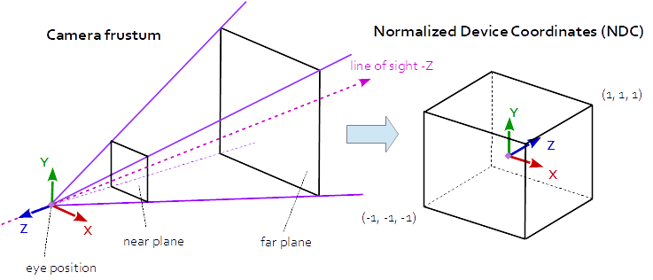

# Learn-three.js

[Three.js Official Site](https://threejs.org/)

[00.Installing Three.js](#installing-threejs)

[01.Basic Scene](#baisc-componments-scene-setup) - [Code](https://github.com/yuzhuchai/Learn-three.js/blob/main/01_baiscScene.js)

[02.Drawing Line](#different-syntax) - [Code](https://github.com/yuzhuchai/Learn-three.js/blob/main/02_line.js)

[03.Text](#text-geometry) - [Code](https://github.com/yuzhuchai/Learn-three.js/blob/main/03_text.js)

[04.Gui](#Materials) - [Code](https://github.com/yuzhuchai/Learn-three.js/blob/main/04_Gui.js)

[05.Materials and Light](#Materials) - [Code](https://github.com/yuzhuchai/Learn-three.js/blob/main/05_materials.js)

[06.Environment Map](#environment-mapping) - [Code](https://github.com/yuzhuchai/Learn-three.js/blob/main/06_envMap.js)

## Installing Three.js
[official doc](https://threejs.org/docs/#manual/en/introduction/Installation)

* With CDN

installing Three with CDN or local files must include `type=module` in any script that refrences it, also use importmap which resolves the bare module specifier 'three'.

        

        

        

note that in the CDN Link you must specify the version number

also Since Import maps are not yet supported by all browsers, it is necessary to add the polyfill es-module-shims.js.

* With npm

with npm install three

* to import all THREE content in JS 

        import * as THREE from 'three';

with CDN, Not all features are accessed through the three entrypoint. Other popular parts of the library — such as controls, loaders, and post-processing effects — must be imported from the examples/jsm subfolder

### BAISC COMPONMENTS SCENE SETUP 

Like any 3D environment, we need some basic components when creating with Three.js - **Scene**, **Camera**, and **Render**

    const scene = new THREE.Scene()
    const camera = new THREE.PerspectiveCamera( 75, window.innerWidth/ window.innerHeight, 0.1, 1000);
    const renderer = new THREE.WebGLRenderer();
    renderer.setSize(window.innerWidth, window.innerHeight);
    document.body.appendChild(renderer.domElement);

1. setting up the scene 
2. setting up the camera, in Three.js there are actually multiple cameras, prespective is one.  
   1. The first attribute is the field of view. FOV is the extent of the scene that is seen on the display at any given moment. The value is in degrees.
   2. The second one is the aspect ratio. You almost always want to use the width of the element divided by the height, or you'll get the same result as when you play old movies on a widescreen TV - the image looks squished.
   3. The next two attributes are the near and far clipping plane. What that means, is that objects further away from the camera than the value of far or closer than near won't be rendered. 
   
 

3. render: use WebGL 
4. then we need to set the size of the render, and add the renderer to the dom element to display on the webpage 

### CREATE OBJECTS INSIDE THE SCENE

Now we have the scene setup we need to add geomentries inside the scene 

    const geometry = new THREE.BoxGeometry( 1, 1, 1 );
    const material = new THREE.MeshBasicMaterial( { color: 0x00ff00 } );
    const cube = new THREE.Mesh( geometry, material );
    scene.add( cube );

    camera.position.z = 5;

1. to create the object we ned a boxGeomentry, This is an object that containes all the points and fill faces of the cube. 
2. a Geometry need a material,
3. then we need a mesh, this is an obaject that takes a geometry and aplies the material to it.
4. with scene.add we can add this mesh to the scene, with default it will be add to the `(0,0,0)` position 
5. we need to move the camera back a little , so the camera is not inside the shape. 

### RENDER THE SCENE 

        renderer.render( scene, camera );

### or render with ANIMATION  

        function animate(){
            requestAnimationFrame( animate )
            renderer.render( scene, camera );
        }

        animate(); 

with a callback function, we create a loop that cause the renderer to draw the scene every time the screen is refreshed. 

        cube.rotation.x += 0.01 
        cube.rotation.y += 0.01
        cube.rotation.z += 0.03;

Finally we need to animate the cube, with modifying the positions this should be placed after `requestAnimationFrame()` and before the `render()` function.

### DIFFERENT SYNTAX

we can set the camera position in the beginning with 

        camera.position.set( 0, 0, 100 ); 

vs 
        
        camera.position.z = 100

### CREATE LINE with BufferGeometry

lines are created with an array of THREE.Vector3 given (tx,ty,tz) position values 

        const points = [];
        points.push( new THREE.Vector3( - 10, 0, 0 ) );
        points.push( new THREE.Vector3( 0, 10, 0 ) );
        points.push( new THREE.Vector3( 10, 0, 0 ) );

        const geometry = new THREE.BufferGeometry().setFromPoints( points );

        const line = new THREE.Line( geometry, material );

Here we are using [BufferGeometry](https://threejs.org/docs/index.html?q=bufferG#api/en/core/BufferGeometry) instead of [BoxGeometry](https://threejs.org/docs/index.html?q=box#api/en/geometries/BoxGeometry)

A representation of mesh, line, or point geometry. Includes vertex positions, face indices, normals, colors, UVs, and custom attributes within buffers, reducing the cost of passing all this data to the GPU.

### TEXT GEOMETRY 

there are many different ways to create 3D texts method 4 from the [official doc](https://threejs.org/docs/index.html#manual/en/introduction/Creating-text) using text geometry

* Using text geometry you need fontLoader and textGeometry Modules
    
        import * as THREE from 'three';
        import { FontLoader } from 'https://unpkg.com/three@0.142.0/examples/jsm/loaders/FontLoader.js';
        import { TextGeometry } from 'https://unpkg.com/three@0.142.0/examples/jsm/geometries/TextGeometry.js';

（With CDN）

### Using [FontLoader](https://threejs.org/docs/#examples/en/loaders/FontLoader) 

to display text Geometry we need a font loader. 
* font loader is a class for lading a font in JSON format, Returns a font that is an array of **shapes** repesenting the font. 
* we need a font file in the JSON formant, which can be converted using [facetype.js](https://gero3.github.io/facetype.js/)
* After using the fontloader, the TextGoemetry should be created as a callback function inside the `loader.load` function, becasue The loader is asynchronous, and the function (callback) you give fires when the loading is done.
  
        let loader = new FontLoader()
        loader.load('yourfont.json', function(font){
        })

* FontLoader has a .loader function, the first parameter need a file path to the font, the second parameter need a callback function (onload) with an argument which is the font, it will be called when loading is complete
* we are initilizing the text geometry inside this callback function: 

        loader.load('yourfont.json', function(font){
            let textGeo = new TextGeometry('some text', {
                font: font, 
                size: 8,
                height: 5, 
                curveSegments: 12, 
                bevelEnabled: true,
                bevelThickness: 10,
                bevelSize: 8,
                bevelOffset: 0,
                bevelSegments: 5
            })
        })

* [TextGeometry](https://threejs.org/docs/#examples/en/geometries/TextGeometry) generate text as a single geometry, which needs a string of text, and a set of parameters consisiting of loaded font and setting for the geometry's parent [ExtrudeGeometry](https://threejs.org/docs/#api/en/geometries/ExtrudeGeometrys). 

* finally inside the callback function right below the textgeometry we need to create material, mesh, and then add the mesh to the scene. 

* To redner the text on the screen, the trick is we must us `requestAnimationFrame`?? need verify 

        function render() {
            requestAnimationFrame(render);
            renderer.render(scene, camera);
        }
        render();

* couple of things to note: 
  
  1. The FontLoader and TextGeometry module have been moved to different folders, in some earlier examples importing the modules is not correct, and they use THREE.FontLoader, which will cause error 
  2. to set the correct camera position and the font size is very tricky. we can start with a small font size, like 8, then move the camera back, like 500. 
  3. Using baiscmaterial create text with no depth

### GUI 

after we setup a scene, we'd like to add some gui controls so we can change the parameters of certain objects easily, this is also good for debugging.

we need to use the dat.gui library, which we can find [here](https://cdnjs.com/libraries/dat-gui) as CDN, but since we have beem using modules, we'd like to keep our code consistant: by importing [modules](https://github.com/dataarts/dat.gui/blob/master/build/dat.gui.module.js)

we can download this file and save it into the module file

        import { GUI } from "../modules/dat.gui.module.js"
        let gui = new GUI()

This Dat.gui library allows us to create "folders" for indivitaul controls with `gui.addFolder('folderName')`: 

        const transformFolder = gui.addFolder('transform')
        transformFolder.add(object, parameter, minValue, MaxValue, step).name('controlName')

* using `.add()` we can add sliders and contols to this folder, 
* using `.name()` we are able to name this control 
* remmebr sicne we are updating the values, we need to use requestAnimationFrame instead of only rendering it once.

A more complicated method to change the color: 

        const materialFolder = gui.addFolder('color')
        const materialParams = {
            baiscColor: material.color.getHex()
        }
        materialFolder.addColor(materialParams, 'baiscColor').onChange(value => material.color.set(value))

        materialFolder.add(material, 'wireframe')

* with changing the material colors, we need to be able to update those colors on change, 
* adding 'wireframe' allows us to toggle wireframe 
  

### MATERIALS and Lights 

https://github.com/mrdoob/three.js/blob/dev/docs/scenes/material-browser.html

In the following we are using [sphereGeometry](https://threejs.org/docs/#api/en/geometries/SphereGeometry) as a standard, also applying the materials back to the text object. 

        sphereGeometry(r, widthSegment, heightSegment)

widthSegments — number of horizontal segments. Minimum value is 3, and the default is 32.

heightSegments — number of vertical segments. Minimum value is 2, and the default is 16.

before we look at materials, we need to also look at the lights, 
#### 1. Ambient Light 

This light globally illuminates all objects in the scene equally.

This light cannot be used to cast shadows as it does not have a direction.

        const light = new THREE.AmbientLight( 0x404040 ); // soft white light
        scene.add( light );

#### 1. MeshBaiscMatierial 
essentially a constant color, no depth, no nothing, just a color.
* change color
* toggle wireframe 

#### 2. MeshDepthMaterial
A material for drawing geometry by depth. Depth is based off of the camera near and far plane. White is nearest, black is farthest.
* toggle wireframe 

#### 3. MeshLambertMaterial
A material for non-shiny surfaces, without specular highlights.
* toggle wireframe 
* change color
* change emmisive color = the same as change color 
* material have reflectivity parameter, the simple way 
* material have refractionRatio parameter

#### 4. NormalMaterial 
A material that maps the normal vectors to RGB colors.
* toggle wireframe 

#### 5. PhongMaterial 
A material for shiny surfaces with specular highlights.
* toggle wireframe 
* change emmisive color = the same as change color 
* change specular color = the same as change color
* material have shininess parameter, the simple way 
* material have reflectivity parameter, 
* material have refractionRatio parameter

#### 6. StandardMaterial 
A standard physically based material, using Metallic-Roughness workflow.
* toggle wireframe 
* change color
* change emmisive color = the same as change color 
* material have roughness parameter, the simple way 
* material have metalness parameter, 
* 

#### 7. ToonMaterial
A material implementing toon shading.
* toggle wireframe 

we can add environment map and texture mapping to the materials, see the next example:

### ENVIRONMENT MAPPING 
